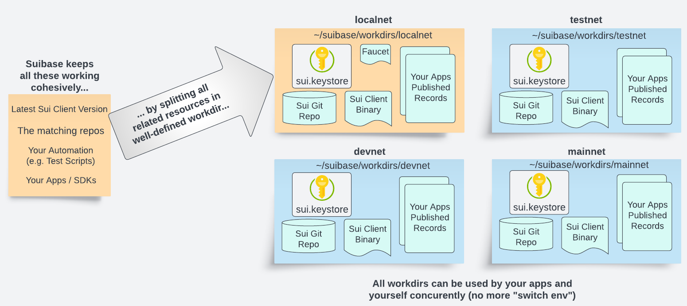

# What is Suibase?

Suibase makes it easy to create "workdirs", each clearly defining a development environment targeting a network.

Other features like:

  * **$ localnet star/stop/status**
  * **$ localnet regen** to quickly reset the network with consistent tests addresses (all pre-funded with an abundance of Sui).
  * **$ localnet publish** for quick edit/debug cycle.
  * **$ lsui/dsui/tsui/msui** shortcut to call the **proper** sui client binary+config combination for localnet/devnet/testnet/mainnet respectively.
  * **$ localnet faucet <address\>**... etc ... you get the picture...

Easy to [install](how-to/install.md).

Suibase adds scripts making it easy to create independent "container" to develop and test your Sui applications. It does not conflict with your existing sui installation.

Suibase is community driven and welcome any Sui dev tool discussion on [Discord](https://discord.com/invite/Erb6SwsVbH)
