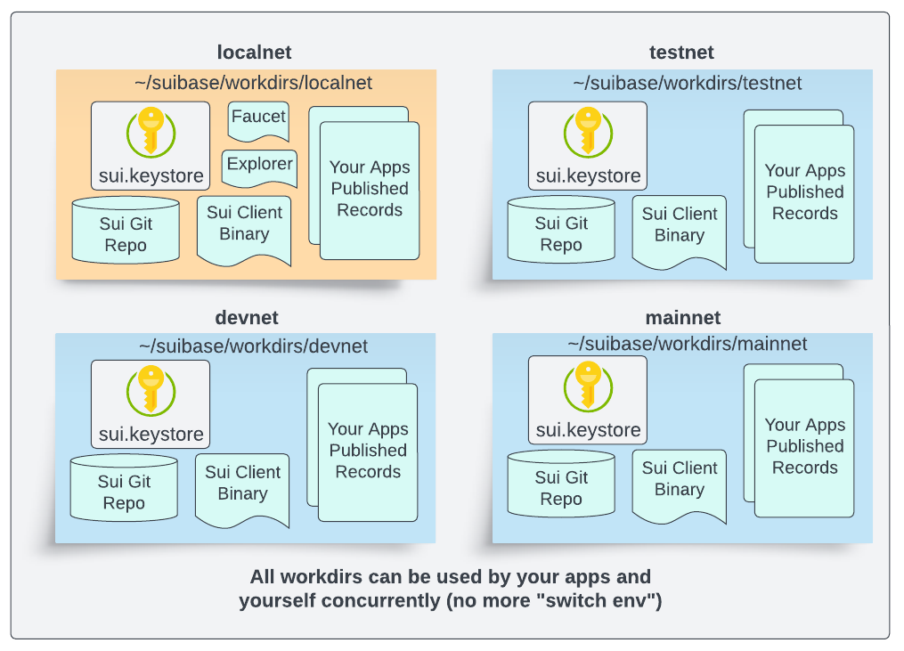

# What is Suibase?

Suibase makes it easy to create "workdirs", each a development environment targeting one network. They are fully isolated — with their own client, keystore and binaries — so you can work across networks concurrently, with no "switch env" needed.

Other features like:
  * Simple "update" commands to keep all your binaries in-sync with the latest network version.
  * **$ lsui/dsui/tsui/msui** scripts call the **proper** sui binary+config combination for localnet, devnet, testnet or mainnet respectively.
  * **$ twalrus/mwalrus/lwalrus** and **tsite/msite** scripts for always using proper binaries and config combination with [Walrus](walrus.md).
  * **$ localnet start/stop/status** scripts and faucet.
  * **$ localnet regen** to reset the network with consistent test addresses and aliases (all pre-funded with an abundance of Sui).

Easy to [install](how-to/install.md).

Suibase never needs or touches the [standard](https://docs.sui.io/guides/developer/getting-started/sui-install) Sui/Walrus install (not even `~/.sui` or its keystore), so both safely coexist.

Community driven. Join us on [Discord](https://discord.com/invite/Erb6SwsVbH)
