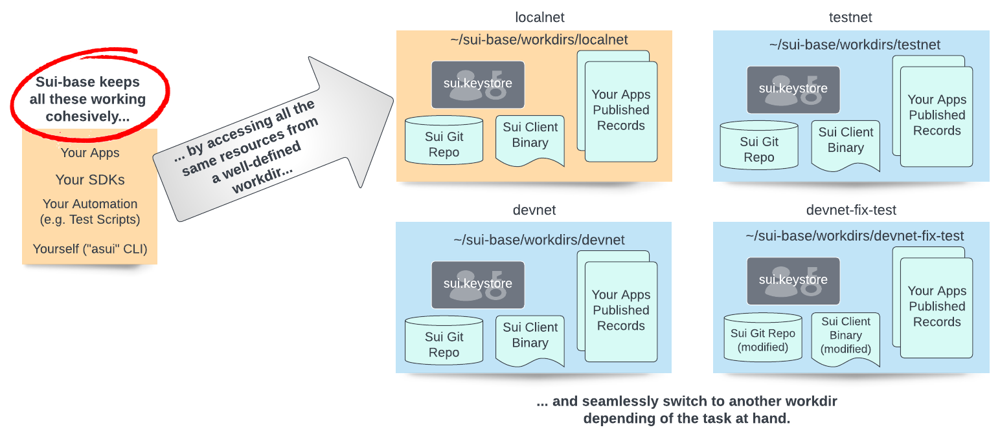

---
hide:
  - toc
---
# What is Sui-Base?

sui-base makes it easy to create "workdirs", each clearly defining a development environment targeting a network.

<figure markdown>
  
</figure>

Other features include:

  * Simple "$ localnet star/stop/status" command.
  * Deterministic "$ localnet regen" with always the same client addresses and customizable gas refill.
  * "$ localnet publish" for quick edit/debug cycle.
  * lsui/dsui/tsui scripts shortcut to call the **proper** sui client binary in respectively the localnet/devnet/testnet workdirs.
  * Stay tune for more...

Easy to [install](how-to/install.md) and not intrusive on your system.

Sui-base is community driven, please join us on [Discord :octicons-link-external-16:](https://discord.com/invite/Erb6SwsVbH) to share your Sui development need!
